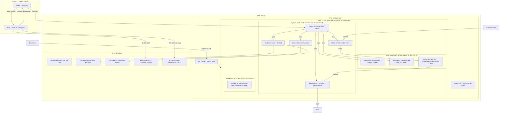

# prod-gke

[](https://www.terraform.io/)
[](https://cloud.google.com/kubernetes-engine)
[](https://kubernetes.io/)
[](https://istio.io/)
[](LICENSE)

> Production-grade, multi-tenant GKE platform — GitOps-driven, zero-trust networking, automated scaling, full observability, and a complete CI/CD pipeline. Deployable with `terraform apply` + one bootstrap script.

---

## The Context

In my 12 years managing production infrastructure across the UAE and Egypt, I've helped three organizations migrate to Kubernetes. Each one had the same experience: the first cluster gets spun up quickly, but then it becomes a snowflake. No one knows exactly what's running. Security reviews stall because nobody documented the network policies. Scaling events cause outages because pod resource requests were never set. Ops team can't hand off to developers because there's no GitOps discipline.

This repo is how I build GKE clusters when the goal is *not* to be clever — it's to build something a team of 10 can operate safely six months after the initial deployment.

Everything in this repo is managed through code and GitOps. If it's not in git, it doesn't exist in the cluster.

---

## Architecture



---

## What's Included

| Layer | Component | Implementation |
|---|---|---|
| **IaC** | Terraform modular | `modules/vpc`, `modules/gke`, `modules/iam`, `modules/artifact-registry` |
| **GitOps** | ArgoCD App-of-Apps | `gitops/argocd/` |
| **Service Mesh** | Istio 1.28.5, strict mTLS | `gitops/apps/istio/` |
| **Secrets** | Vault HA + ESO + Secret Manager | `gitops/apps/vault/`, `gitops/apps/external-secrets/` |
| **Multi-tenancy** | RBAC + ResourceQuota + NetworkPolicy | `gitops/apps/tenants/` |
| **Autoscaling** | HPA + VPA + PDB + NAP | Helm chart + cluster configs |
| **Observability** | Prometheus + Grafana + AlertManager | `gitops/apps/monitoring/` |
| **Alerting** | Platform PrometheusRules + Slack routing | `gitops/apps/monitoring/platform-rules.yaml` |
| **CI/CD** | GitHub Actions + Artifact Registry + WIF | `.github/workflows/`, `modules/artifact-registry/` |
| **Sample App** | Go HTTP API with /metrics + dashboard | `apps/go-metrics-api/` |

---

## Security Controls

| Control | Implementation | Why It Matters |
|---|---|---|
| Private nodes | `enable_private_nodes = true` | Nodes have no external IPs — no direct internet attack surface |
| Workload Identity | KSA → GSA binding | Zero service account keys — nothing to leak or rotate |
| WIF for CI/CD | GitHub Actions → OIDC → GCP | No long-lived CI credentials — token valid only during the job |
| Dataplane V2 (Cilium) | `ADVANCED_DATAPATH` | eBPF NetworkPolicy enforcement — policies actually block traffic |
| Shielded Nodes | Secure Boot + vTPM | Verifiable boot chain — detects kernel-level tampering |
| Binary Authorization | `ENFORCE` mode | Blocks unattested container images from being scheduled |
| mTLS everywhere | Istio `PeerAuthentication STRICT` | All pod-to-pod traffic is encrypted and mutually authenticated |
| Pod Security Standards | `restricted` mode per namespace | No root containers, no privilege escalation, no host namespaces |
| IAP-only SSH | Firewall allows `35.235.240.0/20` | No public bastion needed — GCP identity-proxied SSH |
| VPC Flow Logs | Enabled on node subnet | Full network audit trail for security investigations |
| Secrets never in git | ESO + Secret Manager | All credentials live in Secret Manager; only placeholder tokens committed |

---

## Directory Structure

```
prod-gke/
├── main.tf                          Root module — calls vpc, iam, gke, artifact-registry modules
├── variables.tf                     All input variables with validation
├── outputs.tf                       Cluster endpoint, AR URL, WIF provider, CI SA email
├── versions.tf                      Provider pins: google >= 6.0
├── backend.tf                       GCS remote state (bucket placeholder — fill before init)
├── terraform.tfvars.example         Safe template — copy to terraform.tfvars
│
├── modules/
│   ├── vpc/                         VPC, subnet, Cloud NAT, firewall rules
│   ├── gke/                         GKE cluster + system pool + spot pool + NAP
│   ├── iam/                         Node SA + Vault/ArgoCD/ESO GSAs + WI bindings
│   └── artifact-registry/           Docker registry + CI SA + WIF pool for GitHub Actions
│
├── .github/
│   └── workflows/
│       └── build-push.yaml          Build + push go-metrics-api; update GitOps tag on merge to main
│
├── gitops/
│   └── argocd/
│       └── apps/
│           └── root-app.yaml        Apply once — ArgoCD self-manages everything after this
│
├── gitops/apps/
│   ├── argocd/                      ArgoCD UI Istio Gateway + VirtualService
│   ├── istio/                       Istio base + istiod + gateway (sync-wave ordered)
│   ├── vault/                       Vault HA + GCP KMS auto-unseal + Istio ingress
│   ├── external-secrets/            ESO + ClusterSecretStore + ExternalSecrets
│   ├── monitoring/                  kube-prometheus-stack + AlertManager Slack + PrometheusRules
│   ├── tenants/team-alpha/          Namespace, ResourceQuota, LimitRange, NetworkPolicy, RBAC
│   ├── tenants/team-beta/           Same for team-beta tenant
│   └── sample-app/                  ArgoCD Application for go-metrics-api
│
├── apps/go-metrics-api/
│   ├── main.go                      Go HTTP server with Prometheus metrics
│   ├── Dockerfile                   Multi-stage: golang:1.22-alpine → distroless/static
│   └── helm/go-metrics-api/         Production Helm chart — HPA, VPA, PDB, ServiceMonitor, dashboard
│
└── scripts/
    ├── bootstrap-bucket.sh          Enable APIs + create GCS bucket + init backend
    └── bootstrap-argocd.sh          Install ArgoCD + apply root App-of-Apps
```

---

## Prerequisites

| Tool | Minimum Version | Purpose |
|---|---|---|
| Terraform | 1.9+ | Infrastructure provisioning |
| gcloud CLI | Latest | GKE credentials, GCP auth |
| kubectl | 1.28+ | Kubernetes management |
| helm | 3.12+ | ArgoCD bootstrap |
| Go | 1.22+ | Build sample app (optional — CI handles it) |

---

## Deployment

### Step 1 — Configure

```bash
cp terraform.tfvars.example terraform.tfvars
# Set: project_id, github_owner, and optionally master_authorized_networks
```

### Step 2 — Enable APIs, create state bucket, init backend

```bash
bash scripts/bootstrap-bucket.sh
```

Enables all required GCP APIs, creates the GCS state bucket, writes `backend.tf`, and runs `terraform init`.

### Step 3 — Deploy infrastructure

```bash
terraform plan
terraform apply
```

Creates VPC, GKE cluster, IAM service accounts, Artifact Registry, and Workload Identity Federation pool for GitHub Actions.

After apply, capture the outputs — you'll need them in Steps 5 and 7:

```bash
terraform output artifact_registry_url   # e.g. us-central1-docker.pkg.dev/PROJECT/prod-gke
terraform output ci_sa_email             # prod-gke-ci@PROJECT.iam.gserviceaccount.com
terraform output wif_provider            # projects/.../workloadIdentityPools/github-actions-pool/providers/github-provider
```

### Step 4 — Configure kubectl

```bash
$(terraform output -raw get_credentials_command)
```

### Step 5 — Create secrets in GCP Secret Manager

ESO syncs these secrets into the cluster. Create them before bootstrapping ArgoCD so Grafana and AlertManager start cleanly.

```bash
# Grafana admin credentials (replace <password> with a strong random value)
printf '{"admin-user":"admin","admin-password":"<password>"}' | \
  gcloud secrets create grafana-admin-credentials \
    --replication-policy=automatic --data-file=-

# AlertManager Slack webhook (replace with your real webhook URL)
printf 'https://hooks.slack.com/services/YOUR/SLACK/WEBHOOK' | \
  gcloud secrets create alertmanager-slack-webhook \
    --replication-policy=automatic --data-file=-

# Vault KMS key ring and key (required for auto-unseal — created by bootstrap-argocd.sh)
# See: gitops/apps/vault/values.yaml for key ring / key name configuration
```

### Step 6 — Bootstrap ArgoCD

```bash
bash scripts/bootstrap-argocd.sh
```

Installs Istio, ArgoCD, and applies the root App-of-Apps. After this, ArgoCD reconciles everything from git automatically:

- Istio (waves 0 → 1 → 2)
- ESO + ClusterSecretStore + ExternalSecrets (waves 1 → 2 → 3)
- Vault, Prometheus/Grafana/AlertManager (wave 1)
- Tenant namespaces, go-metrics-api (wave 3)

Monitor sync status:
```bash
kubectl get applications -n argocd
```

### Step 7 — Set GitHub Actions secrets

After `terraform apply`, configure these secrets in your GitHub repository (`Settings → Secrets → Actions`):

| Secret | Value |
|---|---|
| `GCP_PROJECT_ID` | `terraform output -raw gcp_project_id` |
| `GCP_WIF_PROVIDER` | `terraform output -raw wif_provider` |
| `GCP_CI_SA_EMAIL` | `terraform output -raw ci_sa_email` |
| `AR_LOCATION` | Same region as `var.region` (e.g. `us-central1`) |
| `AR_REPO_ID` | `prod-gke` (or the value of `var.artifact_registry_repo_id`) |

### Step 8 — Push the initial image

The CI pipeline triggers automatically on any push to `main` that touches `apps/go-metrics-api/**`. To push the first image manually:

```bash
# Authenticate Docker to Artifact Registry
gcloud auth configure-docker $(terraform output -raw artifact_registry_url | cut -d/ -f1)

AR_URL=$(terraform output -raw artifact_registry_url)
docker build -t ${AR_URL}/go-metrics-api:1.0.0 apps/go-metrics-api/
docker push ${AR_URL}/go-metrics-api:1.0.0
```

After the first image is pushed, subsequent builds are handled automatically by the CI pipeline.

---

## CI/CD Pipeline

The GitHub Actions workflow (`.github/workflows/build-push.yaml`) runs on every push to `main` that changes `apps/go-metrics-api/**`:

1. **Auth** — exchanges a short-lived GitHub OIDC token for a GCP access token via Workload Identity Federation. No service account keys stored anywhere.
2. **Build** — builds the Docker image from the multi-stage Dockerfile.
3. **Push** — pushes `IMAGE:SHORT_SHA` to Artifact Registry.
4. **GitOps update** — commits the new tag into `gitops/apps/sample-app/sample-app.yaml` with `[skip ci]`.
5. ArgoCD detects the commit and re-syncs go-metrics-api automatically.

---

## Secrets Management

All secrets follow the same pattern: **Secret Manager → ESO → Kubernetes Secret → Pod**.

| Secret | Secret Manager key | K8s Secret | Consumer |
|---|---|---|---|
| Grafana admin | `grafana-admin-credentials` | `grafana-admin-secret` | kube-prometheus-stack |
| AlertManager Slack | `alertmanager-slack-webhook` | `alertmanager-slack-secret` | AlertManager config |
| Vault unseal key | GCP KMS (not Secret Manager) | N/A — used directly by Vault | Vault auto-unseal |

The ESO `ClusterSecretStore` is a cluster-scoped backend — any namespace can reference it. Placeholder values in `gitops/apps/external-secrets/clustersecretstore.yaml` are replaced by `bootstrap-argocd.sh` using `terraform output`.

---

## Node Pool Design

| Pool | Type | Machine | Scale | Taint | Purpose |
|---|---|---|---|---|---|
| `system` | On-demand | e2-standard-4 | 1–3/zone | `CriticalAddonsOnly` | ArgoCD, Istio, Prometheus, Vault, ESO |
| `spot-apps` | Spot (up to 91% cheaper) | e2-standard-4 | 0–10 | `gke-spot` | Tenant workloads |
| NAP pools | On-demand or spot | Auto-selected | On-demand | None | Burst scheduling |

---

## Observability

- **Prometheus**: scrapes all namespaces via ServiceMonitor CRDs, 15d retention, 50Gi storage
- **Grafana**: auto-discovers dashboards via `grafana_dashboard: "1"` ConfigMap label (any namespace)
- **AlertManager**: Slack routing via ESO-managed webhook — no hardcoded URLs
- **PrometheusRules**: platform alerts for PodCrashLooping, NodeNotReady, PVCAlmostFull, HPAAtMax, IstiodUnavailable, IstioHighErrorRate
- **Istio metrics**: Prometheus scrapes Istio control and data plane

Access Grafana:
```bash
kubectl port-forward svc/kube-prometheus-stack-grafana 3000:80 -n monitoring
```

Access Vault UI:
```bash
# Via Istio ingress (after updating vault.YOUR_DOMAIN in vault-ingress.yaml):
# https://vault.YOUR_DOMAIN

# Or port-forward for local access:
kubectl port-forward svc/vault-ui 8200:8200 -n vault
```

---

## Sample App — go-metrics-api

A production-quality Go HTTP service that demonstrates the full platform stack:

- **Prometheus metrics**: `api_http_requests_total`, `api_http_request_duration_seconds`, `api_build_info`
- **Grafana dashboard**: pre-built 4-panel dashboard (RPS, error rate, p50/p95/p99 latency, replicas)
- **Graceful shutdown**: drains connections on SIGTERM (30s grace period)
- **Pod Security**: runs as non-root (uid 65532), read-only filesystem, no privilege escalation
- **HPA**: scales on CPU (70%) and memory (80%), slow scale-down (300s stabilization)
- **VPA**: recommendation-only mode — collects right-sizing data without disruptive restarts
- **PDB**: `minAvailable: 1` — keeps at least one replica up during node drains
- **Istio**: mTLS enforced by mesh PeerAuthentication, traffic via VirtualService
- **Topology spread**: replicas distributed across zones for availability
- **CI/CD**: built and pushed automatically by GitHub Actions on every merge to main

---

## About Me

**Mohamed AbdelAziz** -- Senior DevOps Architect
12 years Infra. Engineering, based in the UAE, specializing in GCP, Kubernetes, and platform engineering for MENA enterprise.

- [LinkedIn](https://www.linkedin.com/in/maziz00/) | [Medium](https://medium.com/@maziz00) | [Upwork](https://www.upwork.com/freelancers/maziz00?s=1110580753140797440) | [Consulting](https://calendly.com/maziz00/devops)

---
