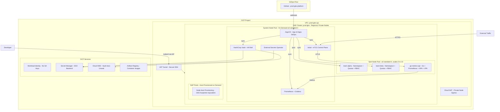

# prod-gke-platform

[](https://www.terraform.io/)
[](https://cloud.google.com/kubernetes-engine)
[](https://kubernetes.io/)
[](https://istio.io/)
[](LICENSE)

> Production-grade, multi-tenant GKE platform — GitOps-driven, zero-trust networking, automated scaling, and full observability stack. Deployable in a single `terraform apply` + one bootstrap script.

---

## The Context

In my 12 years managing production infrastructure across the UAE and Egypt, I've helped three organizations migrate to Kubernetes. Each one had the same experience: the first cluster gets spun up quickly, but then it becomes a snowflake. No one knows exactly what's running. Security reviews stall because nobody documented the network policies. Scaling events cause outages because pod resource requests were never set. Ops team can't hand off to developers because there's no GitOps discipline.

This repo is how I build GKE clusters when the goal is *not* to be clever — it's to build something a team of 10 can operate safely six months after the initial deployment.

Everything in this repo is managed through code and GitOps. If it's not in git, it doesn't exist in the cluster.

---

## Architecture



---

## What's Included

| Layer | Component | Implementation |
|---|---|---|
| **IaC** | Terraform modular | `modules/vpc`, `modules/gke`, `modules/iam` |
| **GitOps** | ArgoCD App-of-Apps | `gitops/argocd/` |
| **Service Mesh** | Istio 1.22, strict mTLS | `gitops/apps/istio/` |
| **Secrets** | Vault HA + ESO | `gitops/apps/vault/`, `gitops/apps/external-secrets/` |
| **Multi-tenancy** | RBAC + ResourceQuota + NetworkPolicy | `gitops/apps/tenants/` |
| **Autoscaling** | HPA + VPA + NAP | Cluster + Helm chart configs |
| **Observability** | kube-prometheus-stack | `gitops/apps/monitoring/` |
| **Sample App** | Go HTTP API with /metrics | `apps/go-metrics-api/` |

---

## Security Controls

| Control | Implementation | Why It Matters |
|---|---|---|
| Private nodes | `enable_private_nodes = true` | Nodes have no external IPs — no direct internet attack surface |
| Workload Identity | KSA → GSA binding | Zero service account keys — nothing to leak or rotate |
| Dataplane V2 (Cilium) | `ADVANCED_DATAPATH` | eBPF NetworkPolicy enforcement — policies actually block traffic |
| Shielded Nodes | Secure Boot + vTPM | Verifiable boot chain — detects kernel-level tampering |
| Binary Authorization | `ENFORCE` mode | Blocks unattested container images from being scheduled |
| mTLS everywhere | Istio `PeerAuthentication STRICT` | All pod-to-pod traffic is encrypted and mutually authenticated |
| Pod Security Standards | `restricted` mode per namespace | No root containers, no privilege escalation, no host namespaces |
| IAP-only SSH | Firewall allows `35.235.240.0/20` | No public bastion needed — GCP identity-proxied SSH |
| VPC Flow Logs | Enabled on node subnet | Full network audit trail for security investigations |

---

## Directory Structure

```
prod-gke-platform/
├── main.tf                          Root module — calls vpc, iam, gke modules
├── variables.tf                     All input variables with validation
├── outputs.tf                       Cluster endpoint, WI pool, kubeconfig command
├── versions.tf                      Provider pins: google >= 6.0
├── backend.tf                       GCS remote state (bucket placeholder — fill before init)
├── terraform.tfvars.example         Safe template — copy to terraform.tfvars
│
├── modules/
│   ├── vpc/                         VPC, subnet, Cloud NAT, firewall rules
│   ├── gke/                         GKE cluster + system pool + spot pool + NAP
│   └── iam/                         Node SA + Vault/ArgoCD/ESO GSAs + WI bindings
│
├── gitops/
│   └── argocd/
│       └── apps/
│           └── root-app.yaml        Apply once — ArgoCD self-manages everything after this
│
├── gitops/apps/
│   ├── istio/                       Istio base + istiod + gateway (sync-wave ordered)
│   ├── vault/                       Vault HA + GCP KMS auto-unseal
│   ├── monitoring/                  kube-prometheus-stack (Prometheus + Grafana)
│   ├── tenants/team-alpha/          Namespace, ResourceQuota, LimitRange, NetworkPolicy, RBAC
│   ├── tenants/team-beta/           Same for team-beta tenant
│   └── sample-app/                  ArgoCD Application for go-metrics-api
│
├── apps/go-metrics-api/
│   ├── main.go                      Go HTTP server with Prometheus metrics
│   ├── Dockerfile                   Multi-stage: golang:1.22-alpine → distroless/static
│   └── helm/go-metrics-api/         Production Helm chart with HPA, VPA, ServiceMonitor
│
└── scripts/
    └── bootstrap-argocd.sh          Install ArgoCD + apply root App-of-Apps
```

---

## Prerequisites

| Tool | Minimum Version | Purpose |
|---|---|---|
| Terraform | 1.9+ | Infrastructure provisioning |
| gcloud CLI | Latest | GKE credentials, GCP auth |
| kubectl | 1.28+ | Kubernetes management |
| helm | 3.12+ | ArgoCD bootstrap |
| Go | 1.22+ | Build sample app (optional) |

**GCP APIs to enable:**
```bash
gcloud services enable \
  container.googleapis.com \
  compute.googleapis.com \
  iam.googleapis.com \
  artifactregistry.googleapis.com \
  secretmanager.googleapis.com \
  cloudkms.googleapis.com \
  cloudresourcemanager.googleapis.com
```

---

## Deployment

### Step 1 — Configure

```bash
cp terraform.tfvars.example terraform.tfvars
# Edit terraform.tfvars: set project_id and master_authorized_networks
```

### Step 2 — Create GCS bucket for remote state (optional but recommended)

```bash
PROJECT_ID=$(grep project_id terraform.tfvars | sed 's/.*"\(.*\)".*/\1/')
gsutil mb -p $PROJECT_ID gs://${PROJECT_ID}-prod-gke-tfstate
gcloud storage buckets update gs://${PROJECT_ID}-prod-gke-tfstate --versioning
# Then uncomment the backend block in backend.tf and run terraform init
```

### Step 3 — Deploy infrastructure

```bash
terraform init
terraform plan
terraform apply
```

### Step 4 — Configure kubectl

```bash
$(terraform output -raw get_credentials_command)
```

### Step 5 — Bootstrap ArgoCD

```bash
bash scripts/bootstrap-argocd.sh
```

After this, all platform components (Istio, Vault, Prometheus, Grafana, tenant namespaces, sample app) are reconciled automatically by ArgoCD.

---

## Node Pool Design

| Pool | Type | Machine | Scale | Taint | Purpose |
|---|---|---|---|---|---|
| `system` | On-demand | e2-standard-4 | 1–3/zone | `CriticalAddonsOnly` | ArgoCD, Istio, Prometheus, Vault |
| `spot-apps` | Spot (up to 91% cheaper) | e2-standard-4 | 0–10 | `gke-spot` | Tenant workloads |
| NAP pools | On-demand or spot | Auto-selected | On-demand | None | Burst scheduling |

---

## Observability

- **Prometheus**: scrapes all namespaces via ServiceMonitor CRDs, 15d retention
- **Grafana**: auto-discovers dashboards via `grafana_dashboard` ConfigMap label
- **AlertManager**: Slack integration (webhook from ESO — not hardcoded)
- **Istio metrics**: Prometheus scrapes Istio control and data plane

Access Grafana:
```bash
kubectl port-forward svc/kube-prometheus-stack-grafana 3000:80 -n monitoring
```

---

## Sample App — go-metrics-api

A production-quality Go HTTP service that demonstrates the full platform stack:

- **Prometheus metrics**: `api_http_requests_total`, `api_http_request_duration_seconds`, `api_build_info`
- **Graceful shutdown**: drains connections on SIGTERM (30s grace period)
- **Pod Security**: runs as non-root (uid 65532), read-only filesystem, no privilege escalation
- **HPA**: scales on CPU (70%) and memory (80%), slow scale-down (300s stabilization)
- **VPA**: recommendation-only mode (no disruptive restarts in production)
- **Istio**: mTLS enforced by mesh PeerAuthentication, traffic via VirtualService
- **Topology spread**: replicas distributed across zones for availability

Build and push:
```bash
cd apps/go-metrics-api
docker build -t gcr.io/YOUR_PROJECT_ID/go-metrics-api:1.0.0 .
docker push gcr.io/YOUR_PROJECT_ID/go-metrics-api:1.0.0
```

---

## About Me

**Mohamed AbdelAziz** -- Senior DevOps Architect
12 years Infra. Engineering, based in the UAE, specializing in GCP, Kubernetes, and platform engineering for MENA enterprise.

- [LinkedIn](https://www.linkedin.com/in/maziz00/) | [Medium](https://medium.com/@maziz00) | [Upwork](https://www.upwork.com/freelancers/maziz00?s=1110580753140797440) | [Consulting](https://calendly.com/maziz00/devops)

---
